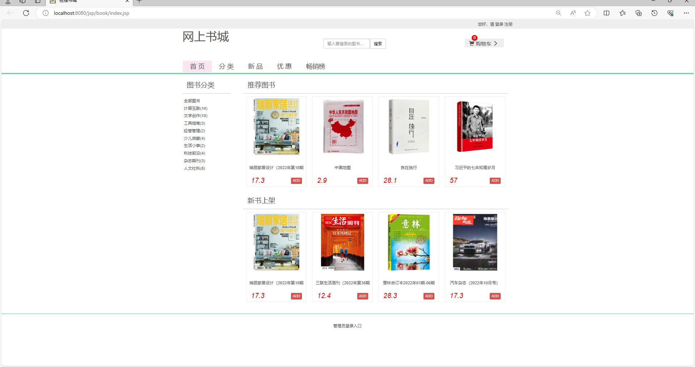
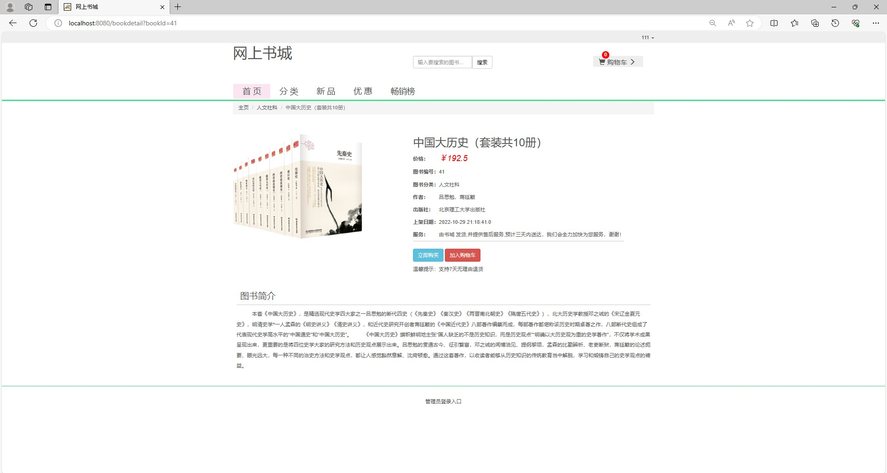
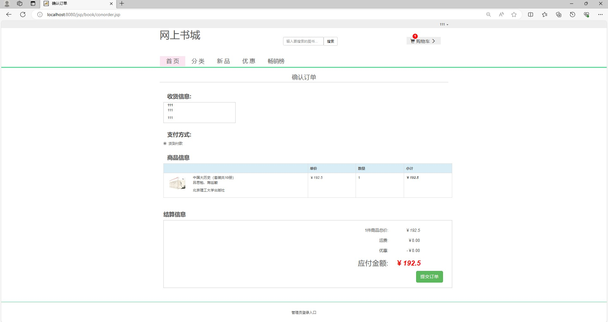
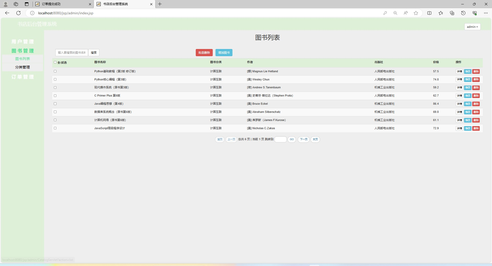
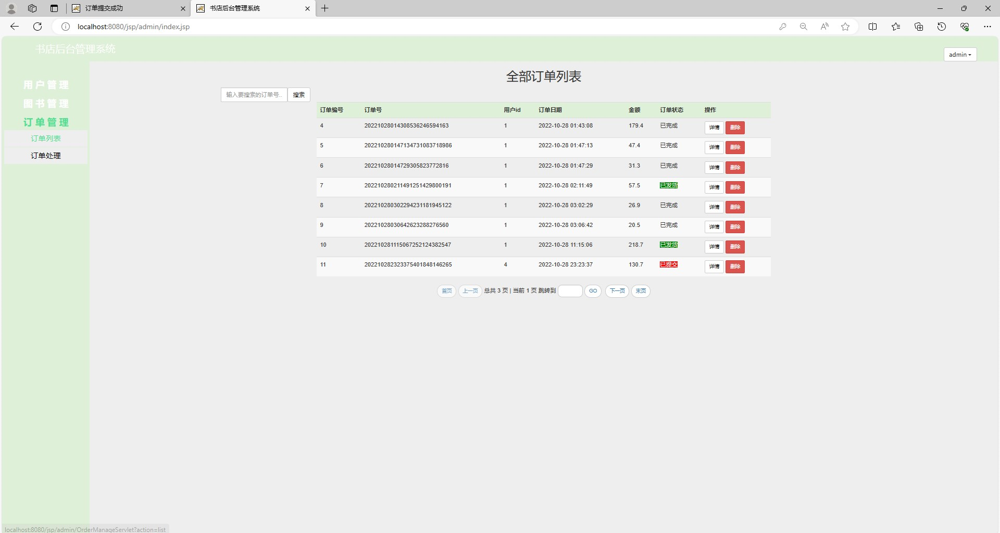
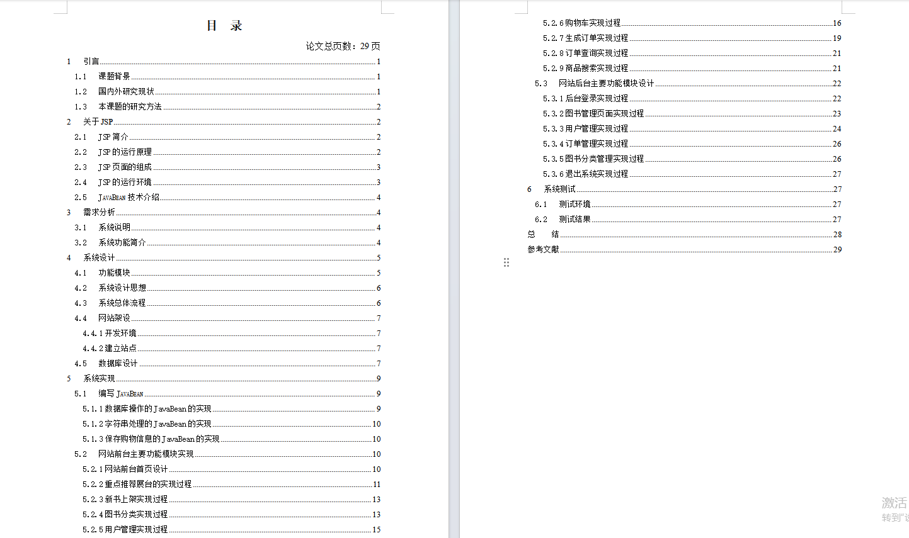
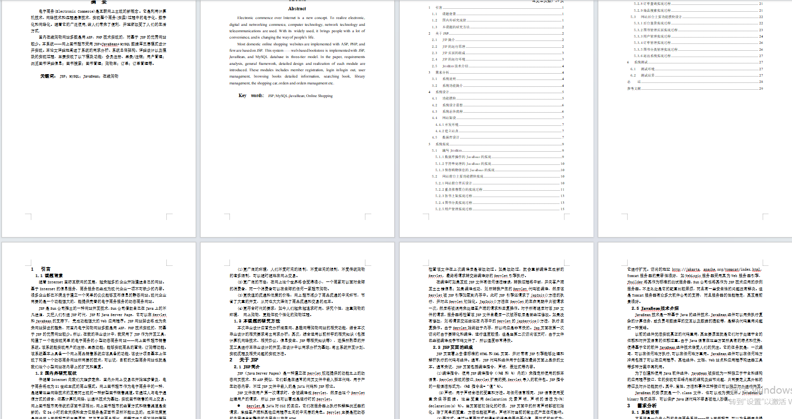

# 图书商城网站

### 一、介绍

基于SSM的图书商城网站

运行环境:idea或eclipse 数据库:mysql

开发语言：java

基于Spring+SpingMVC+Mybatis+jsp的校园互助管理系统

### 二、软件架构

有两个角色：用户和管理员    

项目功能如下：

前台功能：

1. 图书基本展示,包括推荐图书展示和类图书类型展示.

2. 推荐图书包括条幅推荐,热销推荐和新品推荐.

3. 按照图书类型展示商品.

4. 图书详细信息展示.

5. 图书加入购物车.

6. 修改购物车内图书信息,例如数量等.

7. 用户登录.

8. 用户注册.

9. 修改个人信息,包括密码和收获信息.

10. 购物车付款.

11. 用户订单查询.

12. 根据关键字搜索图书.

后台功能：

1. 订单操作:包括按状态查询订单,修改订单状态(发货,完成,删除).

2. 用户操作:包括查询所有用户,新增用户,修改用户密码,修改用户信息和删除用户.

3. 图书类目操作:包括查看所有类目,增加图书类目,修改图书类目信息以及删除图书类目.

4. 图书操作:包括查询所有图书,新增图书,修改现有图书信息以及删除图书.

### 完整项目获取

通过网盘分享的文件：网上书城

链接: https://pan.baidu.com/s/1b8U1dKrccSihW96V7kYneA?pwd=493x 提取码: 493x
--来自百度网盘超级会员v3的分享

通过网盘分享的文件：工具包

链接: https://pan.baidu.com/s/1YmdoJvkjoUjA75wvHLDZ6A?pwd=xm96 提取码: xm96
--来自百度网盘超级会员v3的分享

需要远程项目部署或项目修改和毕业设计也可联系（添加申请时请备注好来意）

通过网盘分享的文件：远程调试部署联系方式

链接: https://pan.baidu.com/s/1W0dDcoZmayG0c7USJDYBYg?pwd=nqd7 提取码: nqd7
--来自百度网盘超级会员v3的分享

### 项目合集(项目不断更新中)
链接: https://pan.baidu.com/s/1nY-zhvAK0CXYcn3g7LzQnQ?pwd=id3c 提取码: id3c
--来自百度网盘超级会员v3的分享

#### 这些项目一起发你了 可以分享给你需要的同学 调试可找我 也接二次修改和项目定制、毕业设计等

### 扫码关注公众号 获取更多项目和编程资料

关注公众号：小猿天天学习

公众号ID：xzzard

## 接毕业设计和论文

微信联系方式：xzxj0206  QQ：3808981644   (支持修改、 部署调试、 支持代做毕设)

接网站建设、小程序、H5、APP、各种系统等，单片机、嵌入式也可以做

选题+开题报告+任务书+程序定制+安装调试+论文+答辩ppt  都可以做

### 三、部分界面展示

### 四、万字论文

